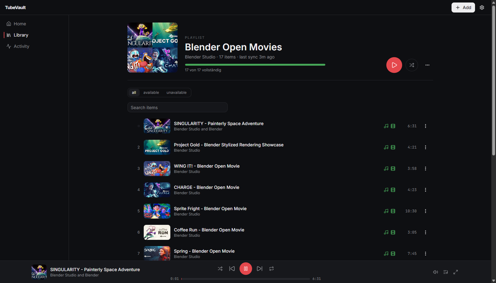

# TubeVault

> Your YouTube playlists, archived on your own disk — and still playable after the originals disappear.

Every curated YouTube playlist rots. Videos get deleted, channels vanish, uploads go private or region-blocked — and you usually find out months later, when the song you loved is just a grey `[Deleted video]` row. Open a playlist you built years ago and odds are a third of it is gone for good.

TubeVault stops the rot: it watches your playlists, downloads every track once as **both MP3 and MP4**, and keeps playing your local copy forever — even after the source is gone from YouTube.



## What it does

- **Add a playlist URL, get a local archive.** Every item is fetched as MP3 (audio) *and* MP4 (video) automatically — no per-track clicking.
- **Built-in player.** Audio and video playback with queue, shuffle, repeat, fullscreen and keyboard controls — streaming from your disk, not from YouTube. Works offline.
- **Survives deletions.** When a video disappears from YouTube, TubeVault marks it as removed but keeps your files playable, with an "archived" badge showing it now only exists in your vault.
- **Re-sync on demand or on a schedule.** New tracks added to the playlist are picked up and downloaded automatically; deleted ones are flagged, never lost.
- **Download status at a glance.** Per-track MP3/MP4 indicators show what's saved, what's queued, and what failed — with one-click retry and a "download missing" button per playlist.
- **Private playlists supported.** Point TubeVault at your browser (Settings → Advanced) and it uses your logged-in YouTube session via yt-dlp's cookie support — also unlocks age-restricted videos.
- **Standalone videos too.** Not everything lives in a playlist; single video URLs work the same way.
- **Local-first, no cloud.** Everything — database, media files, player — lives on your machine. No accounts, no telemetry, no server required.

## Quick start (Windows)

Install the three dependencies (PowerShell):

```powershell
winget install OpenJS.NodeJS.LTS     # Node.js 20+
winget install yt-dlp.yt-dlp         # downloader
winget install Gyan.FFmpeg           # audio/video conversion
```

Then set up TubeVault (restart the terminal first so the new tools are on PATH):

```powershell
git clone https://github.com/<your-username>/tubevault.git
cd tubevault
npm install
npm run build
npm start
```

Open <http://localhost:3000>, click **Add**, paste a playlist URL — downloads start on their own.

**One-click start:** point a desktop shortcut at `scripts/start-tubevault.ps1`. It builds once if needed, starts the server hidden in the background and opens the app in your browser.

### macOS / Linux

Works the same — install `node` (20+), `yt-dlp` and `ffmpeg` via Homebrew or your package manager, then the same `npm` steps. Windows is the primarily tested platform.

## Private playlists & age-restricted videos

YouTube hides private playlists and age-restricted videos from anonymous access. In **Settings → Advanced**, pick the browser you're logged into YouTube with — yt-dlp then reads its cookies for syncs and downloads. Firefox is the most reliable choice; Chrome locks its cookie database on Windows while it's running.

## How it works

Next.js app with a SQLite database (via Drizzle) and an embedded job queue. Syncs fetch playlist contents through [yt-dlp](https://github.com/yt-dlp/yt-dlp), a worker pool downloads each item in both formats with automatic retries, and ffmpeg handles extraction/merging. The player streams your local files through a range-request endpoint. yt-dlp and ffmpeg are external dependencies and not bundled or distributed with this project.

## Development

```bash
npm run dev          # dev server
npm test             # run the test suite
npm run lint         # lint
npm run typecheck    # TypeScript check
```

Design specs and implementation plans live in [`docs/superpowers/`](docs/superpowers/).

## Legal

TubeVault is a self-hosted tool for **personal, private archival** — your own uploads, your own curated playlists, Creative Commons and otherwise freely licensed media (the screenshots above show the CC-licensed [Blender Open Movies](https://studio.blender.org/films/)). It does not circumvent DRM and does not bundle any downloader; it orchestrates the locally installed yt-dlp.

Downloading content may violate the source platform's terms of service and, depending on your jurisdiction, copyright law. You are solely responsible for ensuring that your use is lawful and respects the rights of creators. The authors do not endorse and take no responsibility for any misuse.

## License

MIT — see [LICENSE](LICENSE).
